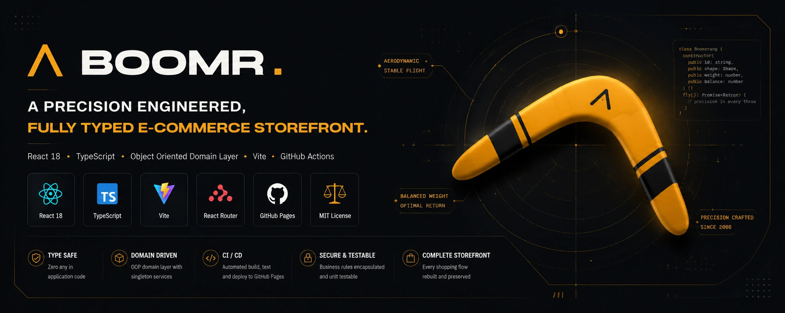
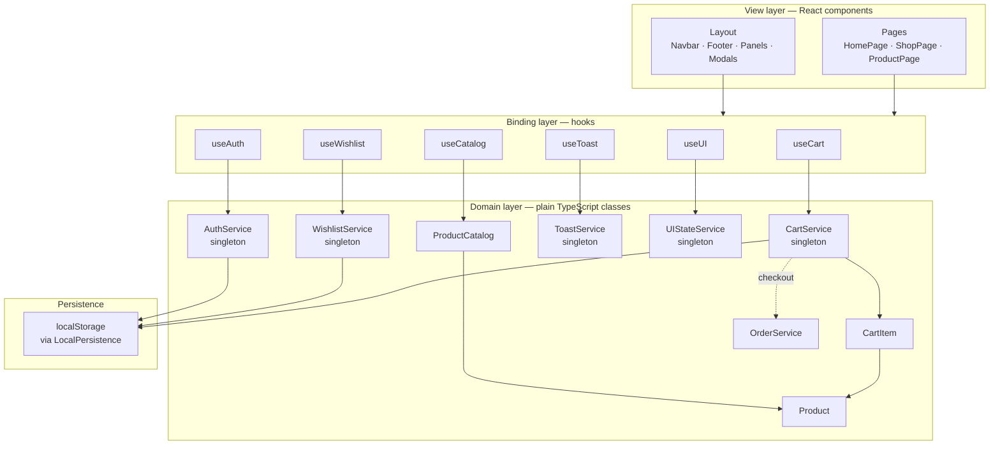
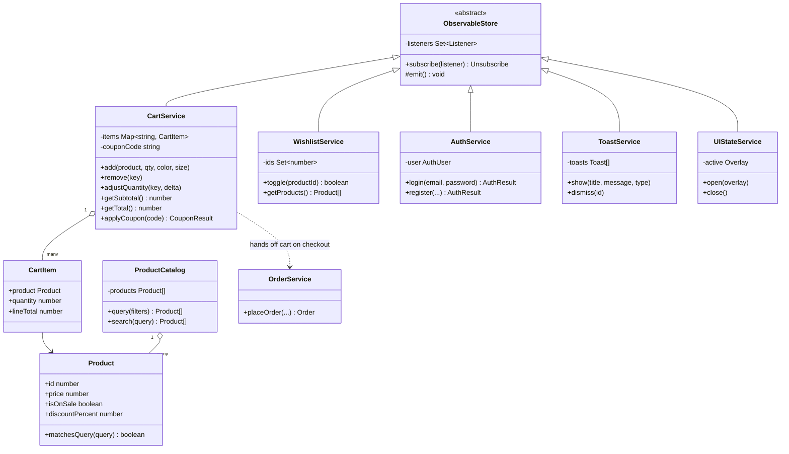
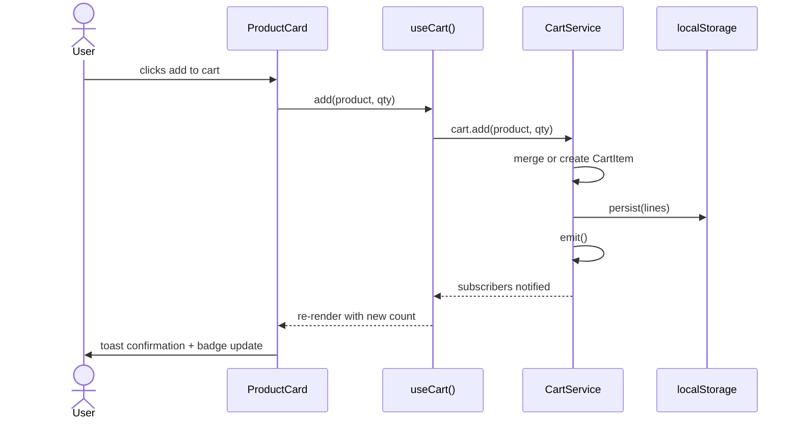
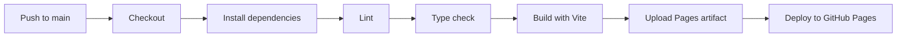

<div align="center">



<h1>BOOMR.</h1>

<p><strong>A precision engineered, fully typed e-commerce storefront.</strong></p>
<p>React 18 · TypeScript · Object oriented domain layer · Vite · GitHub Actions</p>

<p>
  
  
  
  
  
  
</p>

<p>
  <a href="#quick-start">Quick Start</a> ·
  <a href="#architecture">Architecture</a> ·
  <a href="#project-structure">Project Structure</a> ·
  <a href="#deployment">Deployment</a> ·
  <a href="#roadmap">Roadmap</a>
</p>

</div>

---

## Overview

**BOOMR.** is a complete storefront for a fictional boomerang brand. This repository is a full TypeScript and React migration of an original vanilla HTML, CSS, and JavaScript build, restructured around an object oriented domain layer, componentised UI, and a continuous deployment pipeline to GitHub Pages.

The migration preserved the original visual identity, the midnight and ochre design language, the custom cursor, the scroll reveal system, and every shopping flow, while replacing global functions and DOM string templates with typed classes, React hooks, and composable components.

<table>
<tr>
<td width="50%" valign="top">

### What shipped in this migration

- Full **TypeScript** rewrite, zero `any` in application code
- **Object oriented domain layer**: `Product`, `CartItem`, and five singleton services encapsulate all business rules
- **React 18** function components with hooks, no class components in the view layer
- **React Router** based navigation replacing the original `display:none` page switcher
- **GitHub Actions** workflow that lints, type checks, builds, and deploys to GitHub Pages on every push to `main`
- SPA deep link support on GitHub Pages via the `404.html` redirect technique
- Coupon codes, free shipping thresholds, and order confirmations rebuilt as testable service methods

</td>
<td width="50%" valign="top">

### Carried over from the original

- Midnight and ochre visual system, Syne, Inter, and Space Mono typefaces
- Custom animated cursor with pointer device detection
- Scroll reveal animations and marquee ticker
- Full shopping flow: cart, wishlist, search, checkout, and order confirmation
- Accessibility features: skip link, ARIA roles, keyboard focus handling
- Fully responsive layout with a dedicated mobile navigation drawer

</td>
</tr>
</table>

---

## Architecture

The application is split into three layers. UI components never manage business state directly, they read from and call into services through hooks, and the services never import React.



### Why an OOP domain layer inside a React app

Every stateful concern, the cart, the wishlist, authentication, toasts, and the active overlay, is modelled as a class extending a small `ObservableStore` base class that implements the observer pattern. Each class is instantiated once as a singleton, and a thin hook subscribes a component to it with `useSyncExternalStore`. This keeps:

- **Business rules in one place.** Coupon math, free shipping thresholds, and quantity validation live in `CartService`, not scattered across event handlers.
- **The view layer thin.** Components read derived values and call methods; they hold no pricing or persistence logic themselves.
- **State framework agnostic.** The domain layer has no React import. It could back a Vue or vanilla front end unchanged.



### Request and interaction flow, add to cart example



---

## Project Structure

```
boomr-store/
├── .github/workflows/       CI and GitHub Pages deployment pipelines
├── public/
│   ├── images/               product photography and UI art
│   ├── 404.html               GitHub Pages SPA deep link redirect
│   └── .nojekyll
├── src/
│   ├── core/
│   │   ├── models/            Product, CartItem — domain entities
│   │   ├── services/          CartService, WishlistService, AuthService,
│   │   │                      ToastService, UIStateService, ProductCatalog,
│   │   │                      OrderService, ObservableStore, LocalPersistence
│   │   └── ServicesContext.tsx  wires singletons into the React tree
│   ├── hooks/                 useCart, useWishlist, useAuth, useToast,
│   │                          useUI, useCatalog, useReveal, useCountdown
│   ├── components/
│   │   ├── layout/             Navbar, Footer, MobileNav, LoadingScreen, CustomCursor
│   │   ├── product/             ProductCard
│   │   ├── cart/                 CartPanel
│   │   ├── wishlist/             WishlistPanel
│   │   ├── search/               SearchOverlay
│   │   ├── auth/                 LoginModal
│   │   ├── checkout/             CheckoutModal, OrderConfirmationModal
│   │   ├── home/                  Hero, Ticker, FeaturesStrip, DealOfTheDay,
│   │   │                         CategoriesSection, FeaturedSection, BrandStory,
│   │   │                         Testimonials, ShippingSection, NewsletterSection
│   │   └── common/                Icons, StarRating, ToastContainer, OverlayBackdrop
│   ├── data/products.ts        product catalog source records
│   ├── pages/                  HomePage, ShopPage, ProductPage, NotFoundPage
│   ├── styles/global.css       design tokens and component styles
│   ├── App.tsx
│   └── main.tsx
├── index.html
├── vite.config.ts
└── tsconfig.json
```

---

## Feature Tour

<table>
<tr><td width="33%" valign="top">

### Catalog and discovery
- Twelve boomerang designs across eleven categories
- Category, price, and sort filters synced to the URL
- Live search overlay with tag shortcuts
- Deal of the day with a live countdown to midnight

</td><td width="33%" valign="top">

### Cart and checkout
- Persistent cart and wishlist across sessions
- Coupon code engine, `BOOMR20` for 20 percent off
- Free shipping threshold at $100
- Three step checkout: contact, address and shipping, payment
- Generated order numbers and a confirmation screen

</td><td width="33%" valign="top">

### Experience details
- Custom cursor on pointer devices, native cursor on touch
- Scroll reveal animation on every section
- Toast notification queue for every user action
- Fully responsive with a dedicated mobile drawer
- Skip link and ARIA labelling throughout

</td></tr>
</table>

---

## Quick Start

### Prerequisites

- Node.js 18 or newer
- npm 9 or newer

### Install and run

```bash
npm install
npm run dev
```

The app is served at `http://localhost:5173`.

### Available scripts

| Command | Description |
|---|---|
| `npm run dev` | Start the Vite development server with hot module reload |
| `npm run build` | Type check, then produce a production build in `dist/` |
| `npm run preview` | Preview the production build locally |
| `npm run lint` | Run ESLint across the project |
| `npm run typecheck` | Run the TypeScript compiler in check only mode |

---

## Deployment

This repository ships with a ready to use GitHub Actions workflow at `.github/workflows/deploy.yml`. It runs on every push to `main`:



### One time repository setup

1. Push this project to a GitHub repository.
2. In the repository, open **Settings → Pages** and set **Source** to **GitHub Actions**.
3. Open `vite.config.ts` and set `REPO_NAME` to your repository's exact name. If this project is deployed as a user or organisation root site instead of a project site, set `base` to `/` directly.
4. Push to `main`. The **Deploy to GitHub Pages** workflow builds and publishes automatically, and the app becomes available at `https://<your-username>.github.io/<repo-name>/`.

A pull request into `main` triggers the companion `ci.yml` workflow, which lints, type checks, and builds without deploying, so regressions are caught before merge.

---

## Design System

| Token | Value | Usage |
|---|---|---|
| `--midnight` | `#0a0a0f` | Primary background |
| `--ochre` | `#e8a020` | Accent, calls to action |
| `--chalk` | `#f5f2ec` | Primary text |
| `--ff-display` | Syne | Headings and brand |
| `--ff-body` | Inter | Body copy |
| `--ff-mono` | Space Mono | Prices, SKUs, counters |

All tokens live as CSS custom properties in `src/styles/global.css` and are reused consistently across every component, so retheming the storefront means editing one file.

---

## Upgrades Beyond the Original

While migrating, the following gaps in the original vanilla build were closed:

- Replaced eleven dead inline SVG boomerang shape constants with the product photography that was actually rendered, removing unused code.
- Introduced a coupon and free shipping calculation that lives in one auditable method instead of being recomputed inline in several places.
- Added category, sort, and search query parameters to the shop URL, so filtered views are shareable and survive a page refresh.
- Replaced the manual `display:none` page switcher with real client side routing, enabling browser back and forward navigation and deep linking to a specific product.
- Added a GitHub Pages compatible deep link fallback so a hard refresh on `/shop` or `/product/3` resolves correctly instead of 404ing.
- Added continuous integration that lints and type checks every pull request before it can be merged.

---

## Roadmap

- [ ] Persist authenticated sessions against a real identity provider
- [ ] Replace the mock checkout with a Stripe or similar payment integration
- [ ] Add automated component tests with Vitest and React Testing Library
- [ ] Introduce image optimisation and responsive `srcset` output for product photography
- [ ] Internationalisation for currency and language

---

## License

Released under the [MIT License](./LICENSE).

<div align="center">
<sub>Built with React, TypeScript, and an unreasonable amount of care for how a boomerang should fly back.</sub>
</div>
